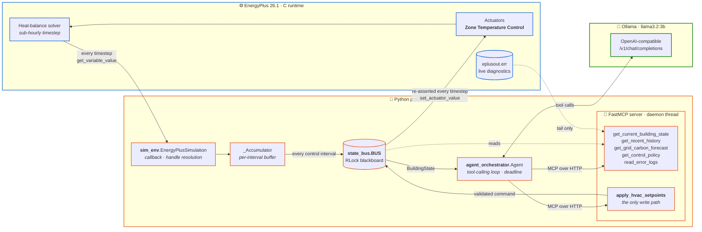
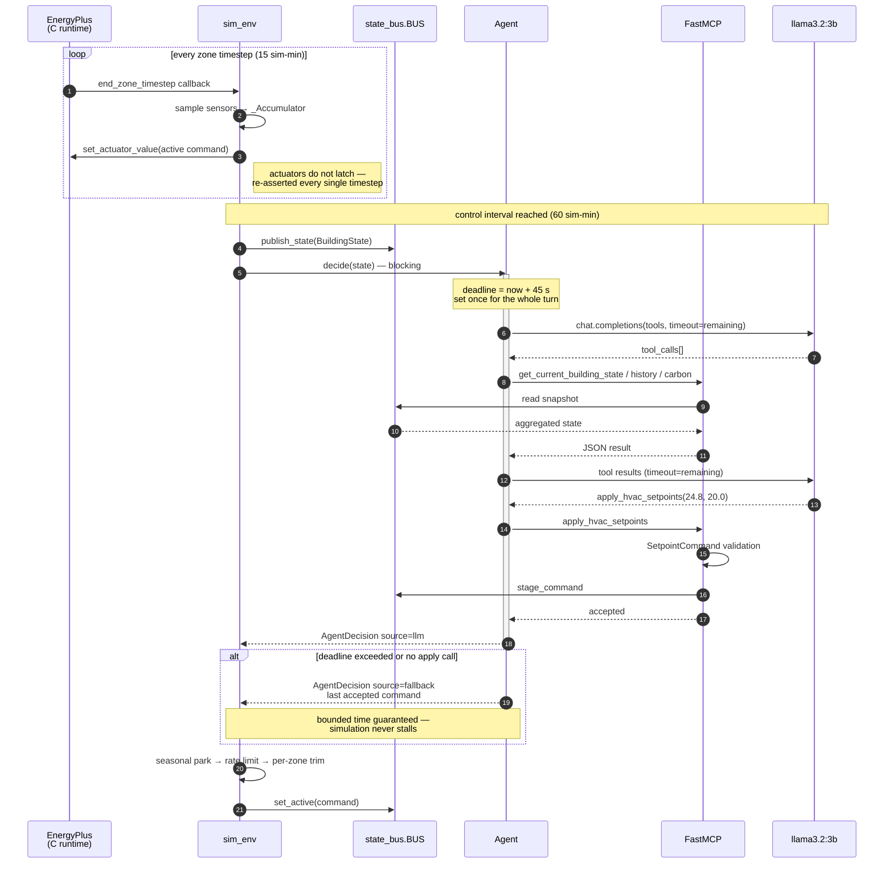
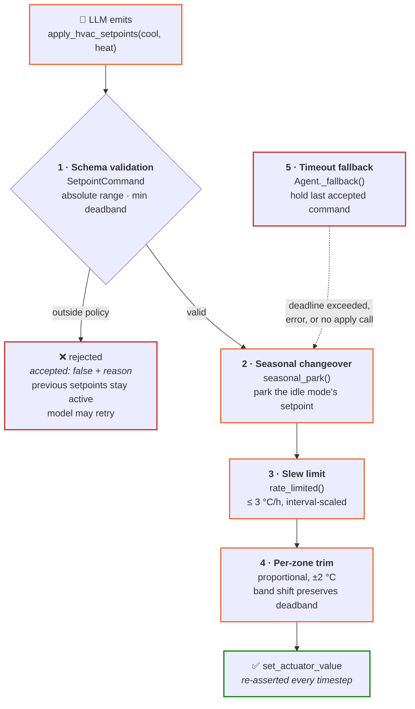

# Eco-Loop Building Agents — System Architecture

> An EnergyPlus building simulation supervised, **while it runs**, by a local
> open-source LLM speaking the Model Context Protocol. No file is rewritten and
> the simulation never restarts: setpoints are injected straight into the live
> solver.

| | |
|---|---|
| **Simulation** | EnergyPlus 26.1.0 via `pyenergyplus` (in-process C API) |
| **Cognitive engine** | Ollama · `llama3.2:3b`, OpenAI-compatible endpoint |
| **Protocol** | FastMCP 3.4 over streamable HTTP, 6 tools |
| **Loop rate** | sensors every zone timestep · agent every 60 simulated min |
| **Measured** | **−8.5 %** summer / **−3.7 %** winter HVAC energy |
| **Reliability** | **336 / 336** agent turns, 0 fallbacks, 0 timeouts, 0 actuation errors |

---

## 1. Overview

Every `N` simulated minutes (15 or 60, configurable) the building's aggregated
state — zone temperatures, humidity, PMV, HVAC electric demand, grid carbon
intensity — is handed to the LLM through MCP tools. The model reasons over that
state, calls tools for more context if it needs them, and finishes by calling
`apply_hvac_setpoints`, whose validated output is written into the simulation's
actuators before the next timestep.

Three threads, one shared blackboard:

1. **The EnergyPlus thread** - runs `run_energyplus()`; owns every C-API call.
2. **The FastMCP HTTP server thread** - serves tool calls over streamable HTTP.
3. **The agent's own call** happens synchronously *on the EnergyPlus thread*
   (by default): `Agent.decide()` blocks the callback until it returns.

The only object all three touch is `eco_loop.state_bus.BUS`, a single
`threading.RLock`-guarded blackboard. The simulation thread is the sole writer
of building state; the MCP tool `apply_hvac_setpoints` is the sole writer of
pending commands. Neither thread ever blocks waiting on the other's lock for
more than a few microseconds.

## 2. Tool-Calling Architecture: bridging the LLM and the C simulation loop

FastMCP (`eco_loop/mcp_tools.py`) exposes six tools, each a thin, validated
wrapper around `BuildingStateBus`:

| Tool | Direction | Purpose |
|---|---|---|
| `get_current_building_state` | read | Latest aggregated sensor snapshot |
| `get_recent_history` | read | Last N intervals + past decisions (trend detection) |
| `get_grid_carbon_forecast` | read | Diurnal carbon-intensity curve, for pre-cooling |
| `get_control_policy` | read | The hard setpoint bounds, so the model doesn't guess |
| `read_error_logs` | read | Tail of `eplusout.err`, bounded (see §4) |
| `apply_hvac_setpoints` | **write** | The only path from LLM output to an actuator |

**Why a real MCP server and not just Python function calls?** The brief asks
for FastMCP specifically because it makes the tool boundary a genuine protocol
boundary: the schema the LLM sees (`OPENAI_TOOL_SPECS` in `mcp_tools.py`) is
the same JSON-Schema FastMCP would serve to Claude Desktop, an MCP Inspector,
or any other MCP client - swapping the cognitive engine for a hosted model
later requires no changes to the tool layer. It also means the security
boundary (`SetpointCommand` validation) lives on the *server* side, not
scattered through client code, so it cannot be bypassed by a different prompt.

**Why does the simulation thread never call FastMCP directly?** Because
`fastmcp`'s client is asyncio-native and `pyenergyplus` callbacks are
synchronous, C-invoked functions with no event loop of their own.
`eco_loop/mcp_client.py`'s `MCPToolBridge` runs a private `asyncio` event loop
on its own daemon thread, opens one long-lived MCP session for the whole
simulation (paying the handshake cost once, not once per control interval),
and exposes a plain blocking `call(name, args, timeout)` that the agent
orchestrator invokes like a normal function. `ECOLOOP_TOOL_TRANSPORT=direct`
in `.env` swaps this for `DirectToolBridge`, which calls the same tool
functions in-process with zero IPC - useful for latency-sensitive demos or
when FastMCP's HTTP transport is unavailable; the tool *contracts and
validation* are identical either way, since both paths ultimately call the
functions in `mcp_tools.TOOL_REGISTRY`.

**Why is `apply_hvac_setpoints` the only write path?** Everything downstream
of the LLM is untrusted input. `apply_hvac_setpoints` constructs a
`pydantic.BaseModel` (`eco_loop.schemas.SetpointCommand`) with field and
model validators enforcing:
- absolute range (`ControlPolicy.cooling_sp_min/max`, `heating_sp_min/max`),
- minimum heating/cooling deadband (prevents simultaneous heat+cool "fighting"),
- (at the simulation layer) a maximum per-interval rate of change
  (`SetpointCommand.rate_limited`), which stops thermostat hunting even if the
  model asks for a large swing.

A command that fails validation is rejected with `accepted: false` and a
reason string; the previously active setpoints stay in force. The model sees
the rejection and can retry - it never has a path to write an invalid value
into `set_actuator_value`.

### What the agent actually modifies (and what it does not)

This is worth stating explicitly, because there are two very different ways to
"let an LLM change a building model" and they produce different artifacts.

**What Eco-Loop does: live actuator injection.** The agent never edits an
`.idf` file. EnergyPlus runs *inside the Python process*, and the agent's
decisions are written straight into the running solver through the Data
Exchange API - `set_actuator_value` on the `Zone Temperature Control /
Cooling Setpoint` and `Heating Setpoint` actuators, re-asserted on **every**
zone timestep (EnergyPlus actuator overrides do not latch). The very next
timestep's heat balance is solved using the setpoint the LLM just chose. There
is no file rewrite, no re-run, and no restart anywhere in the loop.

**What it deliberately does not do: iterative `.idf` regeneration.** The
alternative pattern - have the LLM rewrite the model file and launch a fresh
simulation each time - cannot close a loop *within* a simulation. It can only
compare whole runs after the fact, so it cannot respond to a zone drifting out
of comfort at 14:00 on day 3. Runtime injection is what makes this a genuine
closed loop rather than a batch parameter sweep.

The practical consequence is that the "modified building models" this project
produces are:

| Artifact | What it is |
|---|---|
| `assets/model.idf` | The instrumented baseline - the source example model plus the `Output:Variable` / `Output:Meter` / `Output:SQLite` requests Eco-Loop needs. Committed. |
| `assets/model_MMDD_MMDD.idf` | Runtime-generated variants where `main.py --start/--end` rewrote the `RunPeriod` for a representative-period study. Committed. |
| `outputs/*/agent_decisions.jsonl` | **The actual record of what the agent changed** - one JSON line per control interval with the chosen setpoints, the model's stated reason, which tools it called, decision latency, and whether the turn was a real LLM decision or a fallback. Committed. |

If you want to see "what the AI did to the building", `agent_decisions.jsonl`
is the file to read - it is the moment-by-moment control trail, and it is what
the dashboard's PMV chart and decision table are built from. The baseline run
writes no such file by construction: it is the same model with the agent
detached, so the native thermostat schedules run untouched and the comparison
isolates exactly one variable.

## 3. Prompt Latency Management

An LLM call inside an EnergyPlus callback is a hard real-time constraint: the
C runtime is blocked on the Python call returning. This is one control
interval, end to end — note that the solver is *stopped* for the width of the
`Agent.decide()` bar:

Five layers keep the turn bounded:

1. **Interval batching (throttling).** The callback fires every sub-hourly
   zone timestep, but `_Accumulator` only aggregates - it does not call the
   agent. `EnergyPlusSimulation._on_control_interval` fires once every
   `control_interval_min` simulated minutes (15 or 60; `ECOLOOP_CONTROL_INTERVAL_MIN`
   in `.env`). This is the single biggest latency lever: it turns "one LLM call
   per zone-timestep" (could be thousands per day) into "one LLM call per
   quarter-hour of simulated time" (96/day), amortizing inference cost across
   real building-physics dynamics that do not change meaningfully faster than
   that.
2. **Hard wall-clock deadline.** `Agent.decide()` computes `deadline =
   time.monotonic() + ECOLOOP_LLM_TIMEOUT_S` once, at the start of the turn,
   and every subsequent LLM call and every tool call is given only the
   *remaining* budget (`self.client...create(..., timeout=remaining)`,
   `self.bridge.call(..., timeout=min(8.0, remaining))`). The tool-execution
   loop (`_run_tool_loop`) also caps the number of reasoning rounds
   (`ECOLOOP_LLM_MAX_TOOL_ROUNDS`, default 4) so a model stuck calling
   read-only tools in a loop cannot spin forever even inside the time budget.
3. **Fallback to the last-known-good command.** If the deadline is exceeded,
   the model errors, or it returns prose without ever calling
   `apply_hvac_setpoints`, `Agent._fallback()` returns immediately with the
   **previously accepted command** (or the schedule baseline on the very first
   turn), tagged `source="fallback"` and `confidence=0.0` for later audit in
   the dashboard's decision trail. `sim_env._actuate()` re-asserts whatever
   command is currently active on *every* timestep regardless, so a slow or
   failed agent turn degrades gracefully to "hold current setpoints" rather
   than ever halting or corrupting the simulation.
4. **Model sizing against VRAM (deployment-time lever).** The loop is
   inference-engine-agnostic (`OpenAI(base_url=..., api_key=...)` against
   Ollama or vLLM), so model choice is a tuning decision the timeout machinery
   makes safe rather than a correctness requirement. The decisive factor
   measured here was not parameter count but **whether the weights fit in
   VRAM**: on a 4 GB RTX 4050, `llama3.1:8b` (5.6 GB resident) is split
   25 % GPU / 75 % CPU by Ollama and takes ~18 s per tool call, while
   `llama3.2:3b` (2.6 GB) runs entirely on the GPU at ~4.5 s — a 4× difference
   that decides whether the per-turn deadline is reachable at all. See §6.
5. **Optional non-blocking mode** (`ECOLOOP_NON_BLOCKING_AGENT=true` /
   `--non-blocking`). Runs `Agent.decide()` on a background thread via a
   single-worker `ThreadPoolExecutor`; the simulation thread never waits - it
   applies whichever decision (if any) finished since the last interval and
   keeps the previous command active otherwise. Trades one interval of
   staleness for zero simulation slowdown; useful for design-day sweeps where
   wall-clock throughput matters more than per-interval reactivity.

## 4. Log Handling: bounded-context `read_error_logs`

`eplusout.err` grows for the entire run and can reach megabytes on a model
with many `** Warning **` lines (out-of-range schedules, unmet-hours notices,
etc.). Handing that file to an LLM verbatim would blow the context window and
add unbounded latency to a call that is supposed to be a rare diagnostic aid,
not the main data path.

`mcp_tools.read_error_logs(lines=20)`:

- **Never loads the whole file.** `_tail_file()` seeks to
  `max(0, filesize - lines * 256 - 2048)` bytes from the end and reads forward,
  so cost is `O(lines)`, not `O(file size)`, even for a multi-MB `.err` file.
- **Hard-caps `lines` at 60** (`_MAX_ERR_LINES`) and each returned line at 220
  characters (`_MAX_LINE_CHARS`) - a worst-case response is a few KB, not
  megabytes, regardless of what the model requests.
- **Tolerates a file EnergyPlus still holds open.** On Windows in particular, a
  concurrent read against a file another process is actively writing can raise
  `OSError`; the tool catches that and returns `{"available": false, "reason":
  ...}` instead of raising into the MCP layer (which would surface as a tool
  error to the model - handled gracefully, but wasted a turn) or, worse,
  propagating into the EnergyPlus callback.
- **Reports severity counts, not just raw text**
  (`severe_or_fatal_in_tail`, `warnings_in_tail`), so the model can decide
  whether the tail it received actually needs deeper attention without having
  to re-parse `** Severe  **` / `** Warning **` markers itself.
- **The system prompt explicitly rate-limits its own use**: "Only call
  `read_error_logs` if a reading looks physically impossible... it costs
  context, so do not call it speculatively." Combined with the per-turn
  `ECOLOOP_LLM_MAX_TOOL_ROUNDS` cap, a model cannot turn log-reading into an
  unbounded context sink even if it tries.

## 5. Safety envelope (defense in depth)

Nothing the model emits reaches an actuator unmediated. Five independent stages
sit between a token and the solver, and **none of them depend on the LLM
behaving well** — they hold against an adversarial or simply broken response:

| # | Stage | Guarantees |
|---|---|---|
| 1 | **Schema validation** — `SetpointCommand` field/model validators | No command outside `ControlPolicy` range, and never a deadband below the minimum (which would make heating and cooling fight). Enforced **server-side in the MCP tool**, so a different prompt cannot bypass it. |
| 2 | **Seasonal changeover** — `seasonal_park()` | The idle mode's setpoint is pinned to its policy extreme, so the chiller physically cannot start in heating season. Added after a measured **7 % energy regression** caused by exactly that. |
| 3 | **Slew limit** — `rate_limited()` | Movement capped at `POLICY.max_step_per_hour` °C/h, scaled to the control interval so the permitted ramp is the same physical rate at 15- or 60-minute loops. Stops thermostat hunting. |
| 4 | **Per-zone trim** — `_update_zone_trims()` | Each zone's band is shifted by a bounded proportional correction from its own PMV. Shifting *both* setpoints together preserves the deadband invariant by construction. |
| 5 | **Timeout fallback** — `Agent._fallback()` | A policy-valid command is always returned in bounded time. A hung model degrades to "hold the last good setpoint", never to an unhandled exception inside the EnergyPlus callback. |

> **Why this ordering.** Changeover runs *before* the slew limit so the parked
> value is not itself ramped in slowly; the trim runs last so it operates on the
> command that will actually be applied.

## 6. Measured results and tuning findings

Validated end-to-end on EnergyPlus 26.1.0 + Ollama `llama3.2:3b`,
`5ZoneAirCooled.idf` with Chicago TMY3 weather, 60-minute control interval,
representative one-week run periods, temperature 0 (see §7 for why).

**Summer week, 15-21 July (cooling season)**

| Metric | Baseline | AI-driven |
|---|---|---|
| HVAC electricity | 396.87 kWh | **363.04 kWh (-8.5%)** |
| Real LLM decisions | - | **168/168 (0 fallbacks, 0 timeouts, 0 actuation errors)** |
| Mean PMV, occupied | -0.43 | **-0.02** (much closer to neutral) |
| Worst-zone PMV in band, occupied | 88.2% | 75.0% |

**Winter week, 15-21 January (heating season)**

| Metric | Baseline | AI-driven |
|---|---|---|
| HVAC electricity | 67.60 kWh | **65.13 kWh (-3.7%)** |
| Real LLM decisions | - | **168/168 (0 fallbacks, 0 timeouts, 0 actuation errors)** |
| Mean PMV, occupied | +0.06 | -0.18 |
| Worst-zone PMV in band, occupied | 97.3% | 65.5% |

336 consecutive agent turns across both weeks with no fallback, no timeout and
no actuation error. Agent latency: mean ~2.2 s, max 43 s against a 45 s budget.

**Read the comfort rows carefully.** The agent holds occupants *closer to
thermal neutrality on average* than the baseline does in summer (-0.02 vs
-0.43), while using 8.5% less energy. The lower "in band" percentage is a
different statement: the metric is the **worst zone at each timestep**, so one
unhappy zone out of five fails the whole interval. Per-zone the AI run is
86-96% in band. §8 explains why one setpoint pair cannot satisfy five zones,
and what it would take to fix. Winter savings are small because the baseline's
heating schedule is already well tuned and the building coasts on internal
gains for much of the occupied period, leaving little headroom.

Three findings from getting there are worth recording, because each is a trap
that any similar LLM-in-the-loop system will hit:

**Model size must be chosen against VRAM, not benchmark quality.** On a 4 GB
RTX 4050, `llama3.1:8b` (5.6 GB resident) is split 25% GPU / 75% CPU by Ollama
and takes ~18 s per tool call; `llama3.2:3b` (2.6 GB) fits entirely in VRAM and
takes ~4.5 s - a 4x speedup that decides whether the per-turn deadline is
achievable at all. This is the concrete form the "local inference quantization"
lever from §3 takes in practice.

**A prompt that mandates exploration will starve the decision.** The first
working run produced only 4/48 real decisions. Every one of the 44 fallbacks
had the identical tool sequence - `get_current_building_state`,
`get_recent_history`, `get_grid_carbon_forecast` - because the system prompt
listed those as numbered steps and the round budget (`max_tool_rounds`) ran out
before the model reached the decision step. Two changes fixed it: exploration
tools were demoted to explicitly optional, and `Agent._force_decision()` now
closes any turn that used its whole budget without committing, re-calling the
model with `tool_choice` pinned to `apply_hvac_setpoints`. Result: 48/48.

**A small model needs the direction of the fix, not just the metric.** Given
PMV = -1.0 and a `too_cold` label, `llama3.2:3b` reliably *lowered* the cooling
setpoint to 22 C - simultaneously the coldest and the most energy-intensive
choice available, and the reason the first complete run came in 8% *worse* than
baseline. The model had the number and the label but not the causal link to an
action. Encoding the physics explicitly - both as a prompt section ("PMV below
-0.5 means over-cooled: RAISE cooling_sp, this fixes comfort AND cuts energy")
and as a computed `comfort_action_hint` field on every observation
(`schemas.BuildingState.comfort_action_hint`) - flipped the same model from
-8.0% to +9.2%. Worth noting *why* this is a win-win: with summer clothing
(clo = 0.5, met = 1.2) ISO 7730 puts comfort-neutral near a 25 C zone
temperature, so the baseline's 23.9 C setpoint was already over-cooling. The
agent's job was to find that, and it could not until the observation said which
way to move.

## 7. Reproducibility: why the controller runs at temperature 0

Early tuning produced summer comfort figures of 67.3%, 70.0%, 76.4% and 69.5%
across four near-identical configurations. That ~9-point spread is the same
magnitude as the effects being tuned for, which makes single-run comparisons
worthless: any "improvement" could be sampling noise. Energy was far more
stable over the same runs (6.8-8.2%), so the instability was specific to the
comfort metric, which depends on a handful of boundary intervals.

The controller now runs at `temperature = 0`. This is the right setting on its
own merits - a supervisory controller should not make different decisions from
identical inputs - and it was verified rather than assumed. Two runs of the
identical summer configuration produced:

| | Replicate 1 | Replicate 2 |
|---|---|---|
| HVAC energy | 363.04 kWh | 363.04 kWh |
| Comfort in band | 75.0% | 75.0% |
| Mean PMV | -0.02 | -0.02 |
| Identical setpoint decisions | 157 / 168 (93.5%) | 157 / 168 (93.5%) |

Aggregate outcomes are identical to the last decimal, while 11 of 168
individual decisions still differ. Every divergence falls between 02:00 and
06:00 - **unoccupied setback hours**, where the choice between a 24 C and a
26 C cooling setpoint changes nothing because the building is empty and the
band is parked anyway. The residual nondeterminism (llama.cpp does not
guarantee bitwise-identical logits across runs even at temperature 0, because
batched GPU reductions are not associative) is therefore confined to decisions
that have no physical consequence, and the controller is deterministic wherever
determinism matters.

Practical consequence: the numbers in §6 are reproducible. Re-running
`python main.py run-all` on the same model, weather file and LLM reproduces
them, which is the property that makes the comparison auditable rather than
anecdotal.

## 8. Known limitation: one setpoint pair for five zones

The agent issues a **single global `(cooling_sp, heating_sp)` pair** that is
written to every controlled zone. The baseline it is compared against has an
independent thermostat per zone. This is the dominant remaining source of the
comfort gap, and it is worth being precise about, because the headline metric
makes it look larger than it is.

Per-zone results from the summer week (occupied hours, AI run):

| Zone | in band | mean PMV | mean occupied temp |
|---|---|---|---|
| SPACE3-1 | 99.1% | +0.01 | 24.8 C |
| SPACE2-1 | 95.0% | +0.03 | 24.5 C |
| SPACE1-1 | 91.4% | -0.08 | 24.7 C |
| SPACE4-1 | 81.8% | -0.08 | 24.2 C |
| SPACE5-1 | 80.9% | -0.23 | 24.6 C |

Every individual zone is between 81% and 99% in band. The headline figure is
lower because the reported metric is deliberately the **worst zone at each
timestep** - a single unhappy zone fails the whole interval. That is the
conservative choice and it is applied identically to the baseline, so the
comparison stays fair, but it means the number reflects the *hardest* zone
rather than the average occupant.

The zones differ in orientation, envelope exposure and internal gain, so their
loads differ; no single setpoint pair satisfies all five simultaneously. The
baseline's per-zone thermostats can, which is precisely the advantage it holds.

The fix is architectural rather than cognitive: `apply_hvac_setpoints` would
take an optional per-zone mapping, `sim_env._actuate` already holds per-zone
actuator handles (`self._cool_act[zone]`) and would simply write different
values, and the observation already reports per-zone PMV. What it costs is
prompt complexity - the agent must reason about five coupled zones per turn
rather than one - which is a poor trade for a 3B model at a 60-minute control
interval, and is the reason it was not attempted here. On a larger local model
this is the highest-value next change.

## 9. Data flow summary for the dashboard

- `sim_env.py` runs EnergyPlus with `-r` (ReadVarsESO), producing
  `eplusout.csv`, and `idf_utils.instrument_idf` injects
  `Output:SQLite,SimpleAndTabular;` so `eplusout.sql` exists as a fallback.
- `BuildingStateBus.record_decision` appends one JSON line per control
  interval to `outputs/ai/agent_decisions.jsonl` - the ground truth for the
  dashboard's PMV scatter and decision trail (setpoints, reason, latency,
  fallback vs. LLM source).
- `eco_loop/eplus_outputs.py` parses the ReadVarsESO CSV header format
  (`Key:Variable [Unit](Frequency)`) into tidy per-zone/per-facility series;
  `dashboard.py` (Streamlit) joins those with the decision log for the
  dual-axis energy chart, the PMV boundary plot, and the headline % savings
  metric.
